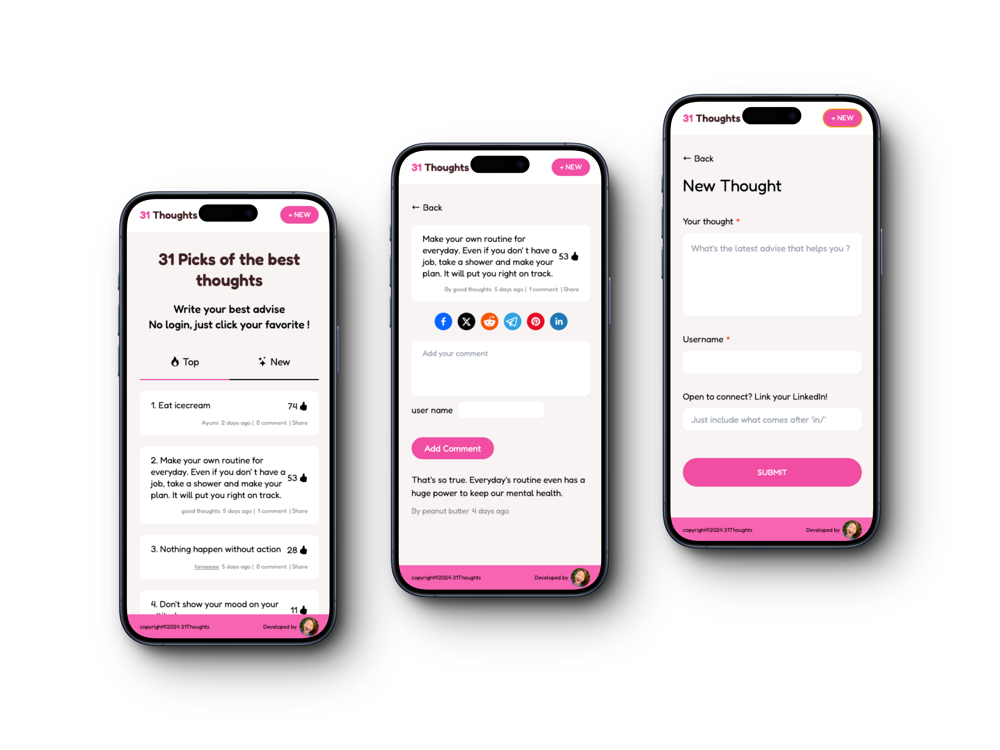

#  31Thoughts 
>
> Project Description

An advice-sharing platform where everyone can write a post and add comments without needing an account.

> Key Features

- Sort and display 31 posts by number of likes or in latest post order.
- Create new posts and engage with comments.
- If a user adds their LinkedIn URL when creating a post, their username becomes clickable for easy linking.
- Share posts effortlessly with social media icons.
- Experience real-time updates on the number of likes and comments.

> Code Snippet

Post schema with comment and like features
```javascript
const postSchema = new Schema(
    {
        subject: {
            type: String,
            required: true,
        },
        author: {
            type: String,
            required: true,
        },
        linkedin: {
            type: String
        },
        comments: [
            {
                type: Schema.Types.ObjectId,
                ref: "Comment",
            },
        ],
        likes: {
            type: Number,
            default: 0
        }
    },
    {timestamps: true}
);
```

When clicking 👍 on posts, the number will be updated in the backend, and then the posts will be sorted by their assigned state.

```javascript
const handleLike = async (postId) => {
        try {
            const response = await axios.post(`${baseUrl}/posts/${postId}/like`);
            setPosts(prevPosts => {
                if(sortBy === "date") {
                    return prevPosts.map(post => {
                        if(post._id === postId) {
                            return {...post, likes: response.data.likes};
                        }
                        return post;
                    }).sort((a, b) => new Date(b.createdAt) - new Date(a.createdAt)).slice(0, 31);
                }
                if(sortBy === "likes") {
                    return prevPosts.map(post => {
                        if (post._id === postId) {
                            return {...post, likes: response.data.likes};
                        }
                       
                        return post;
                    }).sort((a, b) => b.likes - a.likes).slice(0, 31);
                }
            });
        } 
        catch(err) {
            console.error("Error liking post:", err);
        }
    };

```

> Project Mockups


www.31thoughts.com


